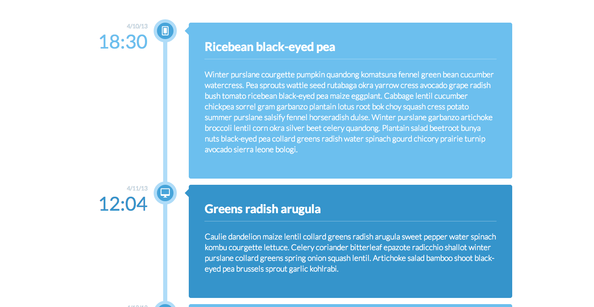

# Web Layout - Timeline

This assignment serves to reinforce responsive layouts, exercise positioning with CSS

## Objectives

* Exercise control of CSS display types, positioning
* Reinforce concepts of layout and display types
* At large widths the entries should fill most of page with reasonable space on the left and right.
* At tablet widths the entries should fill the page with very little space on either side.
* At mobile widths the date and time should appear above the entry text instead of to the left of the timeline.

After completing this assignment, you should be able to create a responsive layout in HTML and CSS from scratch.



---

### Setup
Make sure to run:
```
npm install
```
before trying to build or develop this project.

### Build
#### Production
Create a production build using:
```
npm run build
```
...once finished building, open `./dist/index.html` from source root to view website. Alternatively, visit the GitHub Pages URL for this project at: [https://mannie-exe.github.io/web-layout-timeline](https://mannie-exe.github.io/web-layout-timeline).

#### Development
Run the Vite development server using:
```
npm run dev
```
and the development web page can be viewed (by default) at [http://127.0.0.1:8080/web-layout-timeline](http://127.0.0.1:8080/web-layout-timeline).

### Technologies
* Vite
* PostCSS
* Iconify
* Unplugin Icons
* Sass/SCSS

...and a little more.
